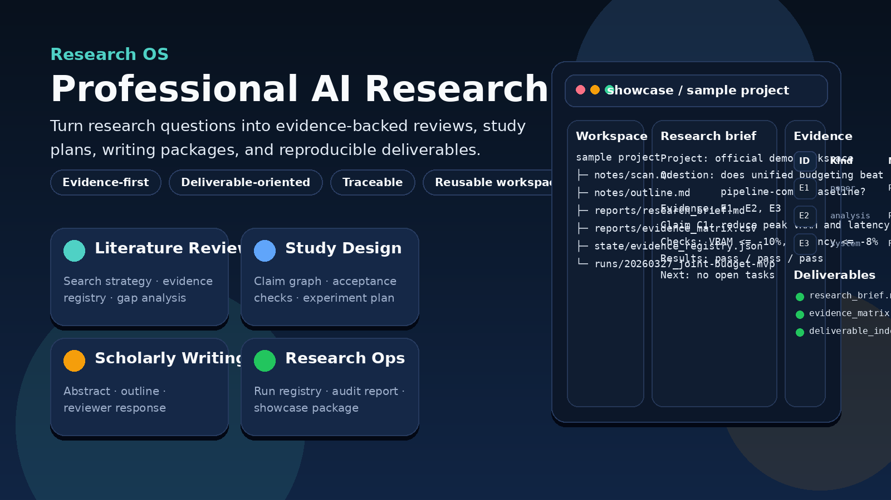
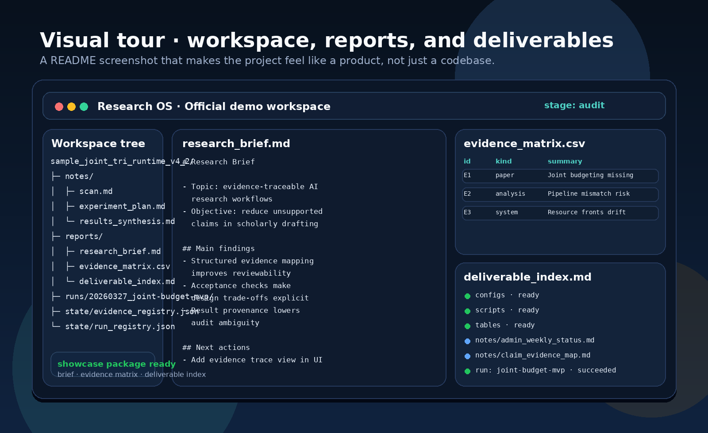
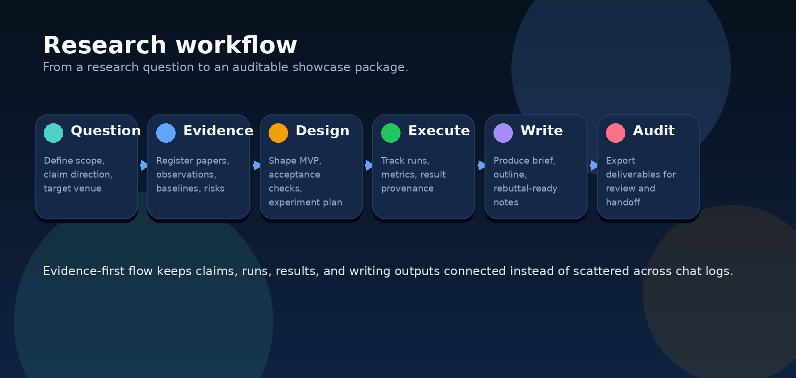
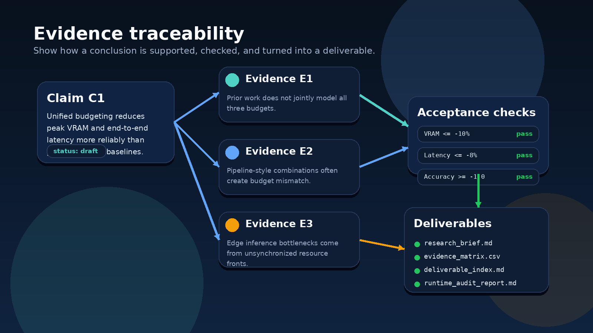

# Research OS · Professional AI Research Assistant

<p align="center">
  
</p>

<p align="center">
  <a href="https://github.com/TYSJY/human-research-scanning-system/actions/workflows/ci.yml"></a>
  
  
  <a href="https://github.com/TYSJY/human-research-scanning-system/stargazers"></a>
</p>

<p align="center"><strong>Professional AI research assistant for literature review, study design, scholarly writing, and reproducible research operations.</strong></p>

<p align="center">
  <a href="#visual-tour">Visual tour</a> ·
  <a href="#install">Install</a> ·
  <a href="#quickstart">Quickstart</a> ·
  <a href="#live-github-signals">Live GitHub signals</a> ·
  <a href="docs/maintainers/github_readme_media.md">README media guide</a>
</p>

Research OS is a **local-first AI research assistant** that helps researchers turn questions into structured, evidence-backed deliverables instead of one-off chat answers.

Research OS 是一个面向 **专业研究工作** 的本地优先 AI 科研助手系统，目标不是只给你一段对话，而是帮助你交付：

- 文献综述包
- 研究设计与实验计划
- 学术写作骨架
- 可追溯、可审计、可复现的研究工作区

它适合这样的场景：

- 你要把一个研究问题快速整理成 **evidence-backed review brief**
- 你要把已有材料收敛成 **claim / MVP / acceptance checks / experiment plan**
- 你要把结构化结果写成 **abstract / outline / rebuttal notes**
- 你希望研究项目不是散落在聊天记录里，而是沉淀成 **workspace + deliverables**

> 当前状态：**Early public release**。仓库已经可以直接公开使用，但仍建议把它看成一个持续演进中的专业科研助手原型。

---

## Visual tour

### 1) Workspace + deliverables at a glance

<p align="center">
  
</p>

### 2) Workflow + evidence traceability

<table>
  <tr>
    <td width="50%" valign="top">
      
    </td>
    <td width="50%" valign="top">
      
    </td>
  </tr>
</table>

---

## What makes this different from a generic AI chat tool

Research OS emphasizes four things:

1. **Evidence first** — back claims with sources before raising confidence
2. **Structured research flow** — scan → design → execute → write → audit
3. **Deliverable-oriented outputs** — research brief, evidence matrix, deliverable index, audit report
4. **Reproducibility** — runs, results, artifacts, and checks stay inside a reusable workspace

如果你只想随手问一个问题，普通聊天工具就够了。  
如果你想把研究工作真正沉淀下来，Research OS 更适合。

---

## Four core capabilities

### 1) Literature Review
- research question 拆解
- 搜索策略与 evidence registry
- baseline / novelty / reviewer objection 梳理
- gap analysis

### 2) Study Design
- claim graph
- acceptance checks
- MVP 收敛
- experiment plan

### 3) Scholarly Writing
- title / abstract
- outline
- related work brief
- rebuttal notes

### 4) Reproducible Research Ops
- run registry
- provenance-aware results
- audit report
- exportable showcase package

---

## Install

### Option A — clone this repository

```bash
git clone https://github.com/TYSJY/human-research-scanning-system.git
cd human-research-scanning-system
python -m pip install .
```

### Option B — install directly from GitHub

```bash
python -m pip install "git+https://github.com/TYSJY/human-research-scanning-system.git"
```

### Option C — contributor mode

```bash
python -m pip install -e .
```

> 面向普通使用者时，优先使用 `python -m pip install .`。`-e .` 更适合开发者和贡献者。

---

## Quickstart

### A. 直接体验官方 demo

```bash
ros quickstart --launch-ui
```

### B. 复制官方 demo 到你自己的目录

```bash
ros demo --root projects --name my-demo --launch-ui
```

### C. 从空白项目开始

```bash
ros init --root projects --name my-research --title "My Research Project"
ros ui projects/my-research
```

---

## Export deliverables

除了 `ros audit` 之外，这一版额外强调 **成果物导出**。

```bash
ros showcase <项目路径>
```

它会生成：

- `reports/research_brief.md`
- `reports/evidence_matrix.csv`
- `reports/deliverable_index.md`

也就是说，项目不仅能跑，还能把当前研究状态整理成适合协作、汇报和交接的结果包。

---

## Live GitHub signals

当前仓库已经公开，所以 README 不再使用“上线前占位”文案，而是直接接入真实仓库信号。

<p align="center">
  <a href="https://github.com/TYSJY/human-research-scanning-system/stargazers"></a>
  <a href="https://github.com/TYSJY/human-research-scanning-system/releases"></a>
  <a href="https://github.com/TYSJY/human-research-scanning-system/actions/workflows/ci.yml"></a>
</p>

<p align="center">
  <a href="https://www.star-history.com/#TYSJY/human-research-scanning-system&Date">
    
  </a>
</p>

---

## Repository structure

```text
research_os/              Python package
research_os/_resources/   打包到安装版里的资源镜像（由同步脚本维护）
configs/                  示例 provider / executor 配置
control_plane/            agents、prompts、schemas、workflows
docs/                     产品文档、参考资料、维护文档、历史归档
examples/                 面向读者的成果物示例包
projects/                 官方工作区样例
scripts/                  辅助脚本（含 bundled resource 同步脚本）
templates/                空项目模板与 run 模板
tests/                    自动化测试
.github/                  CI、Issue 模板、PR 模板、发布工作流
```

---

## Read these docs first

- `docs/product_positioning.md`
- `docs/scenarios.md`
- `docs/deliverables.md`
- `docs/agent_roles.md`
- `docs/evaluation_framework.md`
- `docs/maintainers/public_release_checklist.md`
- `docs/maintainers/open_source_audit.md`

---

## Official workspace samples and deliverable packs

### 官方工作区样例
- `projects/sample_joint_tri_runtime_v4_2/`
- `projects/sample_joint_tri_compress_v4_1/`

### 成果物示例包
- `examples/literature_review_pack/`
- `examples/study_design_pack/`
- `examples/writing_pack/`

前者展示 **工作区如何推进**，后者展示 **这个系统应该交付什么**。

---

## Windows

### 已装 Python
1. 双击 `install_windows.bat`
2. 双击 `start_windows.bat`
3. 浏览器默认打开 `http://127.0.0.1:8765/`

### 没装 Python
直接双击：

- `bootstrap_python_and_start.bat`

它会尝试检测并安装 Python，然后自动安装依赖并启动工作台。

---

## Cite this project

如果你在论文、研究报告或演示中使用了本项目，请使用根目录下的 `CITATION.cff`。GitHub 会自动为它显示 **Cite this repository** 入口。

---

## Development and release

```bash
python -m pip install -e .
pytest -q
python -m compileall research_os tests
python scripts/sync_bundled_resources.py --check
```

Tagging `v*` now triggers the release workflow in `.github/workflows/release.yml`, which builds distributions and attaches them to a GitHub Release.

---

## Security

- 漏洞报告请参考 `SECURITY.md`
- 上线前建议按 `docs/maintainers/public_release_checklist.md` 打开 GitHub 的 topics、social preview、secret scanning、push protection、private vulnerability reporting

---

## License

MIT License.
