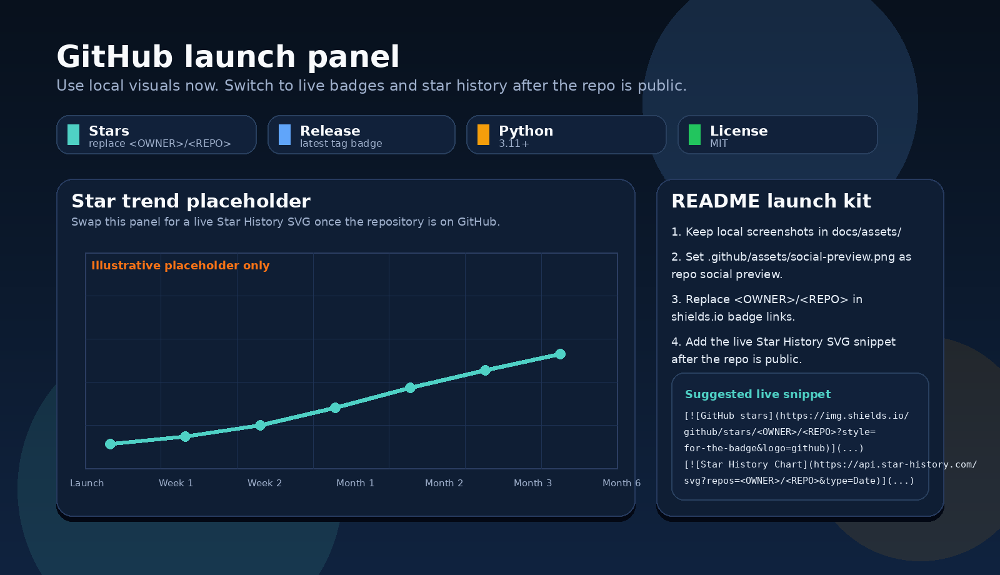

# Research OS · Professional AI Research Assistant

<p align="center">
  
</p>

<p align="center"><strong>Professional AI research assistant for literature review, study design, scholarly writing, and reproducible research operations.</strong></p>

<p align="center">
  <a href="#visual-tour">Visual tour</a> ·
  <a href="#四大核心能力">Core capabilities</a> ·
  <a href="#第一次最短路径">Quickstart</a> ·
  <a href="docs/maintainers/github_readme_media.md">README media guide</a>
</p>

Research OS 是一个面向 **专业研究工作** 的 AI 科研助手系统，目标不是只给你一段对话，而是帮助你交付：

- 文献综述包
- 研究设计与实验计划
- 学术写作骨架
- 可追溯、可审计、可复现的研究工作区

它适合这样的场景：

- 你要把一个研究问题快速整理成 **evidence-backed review brief**
- 你要把已有材料收敛成 **claim / MVP / acceptance checks / experiment plan**
- 你要把结构化结果写成 **abstract / outline / rebuttal notes**
- 你希望研究项目不是散落在聊天记录里，而是沉淀成 **workspace + deliverables**

---

## Visual tour

### 1) Workspace + deliverables at a glance

<p align="center">
  
</p>

### 2) Workflow + evidence traceability

<table>
  <tr>
    <td width="50%" valign="top">
      
    </td>
    <td width="50%" valign="top">
      
    </td>
  </tr>
</table>

### 3) GitHub launch media panel

<p align="center">
  
</p>

这套仓库已经直接带上：

- `docs/assets/*.png`：README 展示图
- `.github/assets/social-preview.png`：GitHub 社交分享图
- `docs/maintainers/github_readme_media.md`：上线后替换 live badge / star history 的说明

<details>
<summary>仓库公开后再切成真实 GitHub star 趋势</summary>

把 `<OWNER>/<REPO>` 替换成你的真实仓库名，然后按 `docs/maintainers/github_readme_media.md` 里的 snippet 打开：

- GitHub stars badge
- GitHub release badge
- Live star history chart

</details>

---

## 这个项目和普通 AI 聊天工具的区别

Research OS 更强调四件事：

1. **Evidence first**：先补证据，再升高 claim 强度
2. **Structured research flow**：scan → design → execute → write → audit
3. **Deliverable-oriented outputs**：研究 brief、evidence matrix、deliverable index、audit report
4. **Reproducibility**：run、result、artifact、evaluation 都能持续追踪

如果你只想随手问一个问题，普通聊天工具就够了。
如果你想把研究工作真正沉淀下来，Research OS 更适合。

---

## 四大核心能力

### 1) Literature Review
- research question 拆解
- 搜索策略与 evidence registry
- baseline / novelty / reviewer objection 梳理
- gap analysis

### 2) Study Design
- claim graph
- acceptance checks
- MVP 收敛
- experiment plan

### 3) Scholarly Writing
- title / abstract
- outline
- related work brief
- rebuttal notes

### 4) Reproducible Research Ops
- run registry
- provenance-aware results
- audit report
- exportable showcase package

---

## 第一次最短路径

### A. 直接体验官方 demo

```bash
python -m pip install -e .
ros quickstart --launch-ui
```

### B. 复制官方 demo 到你自己的目录

```bash
ros demo --root projects --name my-demo --launch-ui
```

### C. 从空白项目开始

```bash
ros init --root projects --name my-research --title "My Research Project"
ros ui projects/my-research
```

---

## 一个更像“科研助手”的命令：导出成果物

除了 `ros audit` 之外，这一版额外强调 **成果物导出**。

```bash
ros showcase <项目路径>
```

它会生成：

- `reports/research_brief.md`
- `reports/evidence_matrix.csv`
- `reports/deliverable_index.md`

也就是说，项目不仅能跑，还能把当前研究状态整理成适合协作、汇报和交接的结果包。

---

## 仓库结构

```text
research_os/              Python package
research_os/_resources/   打包到安装版里的资源镜像（由同步脚本维护）
configs/                  示例 provider / executor 配置
control_plane/            agents、prompts、schemas、workflows
docs/                     产品文档、参考资料、维护文档、历史归档
examples/                 面向读者的成果物示例包
projects/                 官方工作区样例
scripts/                  辅助脚本（含 bundled resource 同步脚本）
templates/                空项目模板与 run 模板
tests/                    自动化测试
.github/                  CI、Issue 模板、PR 模板
```

---

## 你应该先看哪些文档

- `docs/product_positioning.md`
- `docs/scenarios.md`
- `docs/deliverables.md`
- `docs/agent_roles.md`
- `docs/evaluation_framework.md`
- `docs/maintainers/open_source_audit.md`

---

## 官方样例与成果物示例

### 官方工作区样例
- `projects/sample_joint_tri_runtime_v4_2/`
- `projects/sample_joint_tri_compress_v4_1/`

### 成果物示例包
- `examples/literature_review_pack/`
- `examples/study_design_pack/`
- `examples/writing_pack/`

前者展示 **工作区如何推进**，后者展示 **这个系统应该交付什么**。

---

## Windows 启动

### 已装 Python
1. 双击 `install_windows.bat`
2. 双击 `start_windows.bat`
3. 浏览器默认打开 `http://127.0.0.1:8765/`

### 没装 Python
直接双击：

- `bootstrap_python_and_start.bat`

它会尝试检测并安装 Python，然后自动安装依赖并启动工作台。

---

## 开发与测试

```bash
python -m pip install -e .
pytest -q
python -m compileall research_os tests
python scripts/sync_bundled_resources.py --check
```

---

## 许可

MIT License.
